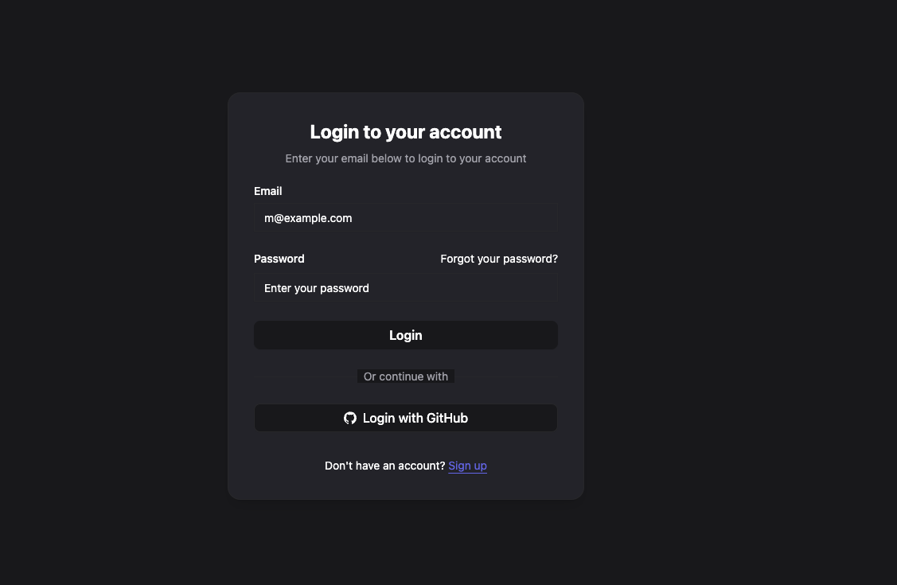

# Live Netlify Website: https://renata-sales-dashboard.netlify.app/

# Project Setup

## 1. Clone the repository

```
git clone https://github.com/anabildebnath/renata-fullstack-assessment.git
cd task2
```

## 2. Install dependencies

```
npm install

```

## 3. Start the development server

```
npm run dev

```

#### This will start the Vite dev server with Hot Module Replacement (HMR). You can access the app at [http://localhost:5173](http://localhost:5173).

## 4. Build for production

```
npm run build

```

## 5. Preview the production build locally

```
npm run preview

```

# Project Features:

## 0. Login and Signup authentication pages



## 1. Add Singular Customer Information


## 2. Add batches of customer data by uploading .xlsx/.xls files


## 3.  Search based on any keywords


## 4.  Apply filters based on customer data types


## 5. Dynamically evolving chart showing Total Customers, New Customers based on date stamps, Median age, income grouped by division and many more


## 6.  Analytics with few different ways of showcasing data through charts - mock examples


## 7. User settings to update user data


## 8.  Data files containing uploaded file history


## 10. Pagination, batch deletion and logout navigation


